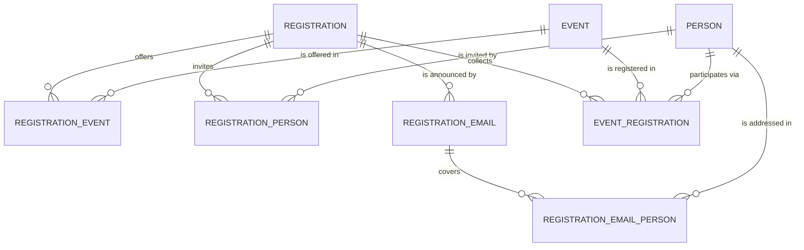

# Entity Model

## Entity Relationship Diagram

### PERSON

An individual who can be invited to events and registered for them.

| Attribute     | Description                                    | Data Type | Length/Precision | Validation Rules       |
|---------------|------------------------------------------------|-----------|------------------|------------------------|
| id            | Unique identifier                              | Long      | 19               | Primary Key, Sequence  |
| last_name     | Last name of the person                        | String    | 100              | Not Null               |
| first_name    | First name of the person                       | String    | 100              | Not Null               |
| email         | Email address invitations are sent to          | String    | 255              | Not Null, Format: Email |
| date_of_birth | Date of birth of the person                    | Date      | 10               | Optional               |
| active        | Whether the person can currently be invited    | Boolean   | 1                | Not Null               |
| member_id     | Member number from the club's membership list  | Integer   | 10               | Optional               |

### EVENT

An event that persons can be invited to and register for.

| Attribute   | Description                                              | Data Type | Length/Precision | Validation Rules      |
|-------------|----------------------------------------------------------|-----------|------------------|-----------------------|
| id          | Unique identifier                                        | Long      | 19               | Primary Key, Sequence |
| title       | Title of the event                                       | String    | 200              | Not Null              |
| description | Additional description shown to invitees                 | String    | 1000             | Optional              |
| location    | Where the event takes place                              | String    | 255              | Optional              |
| from_date   | Start date of the event                                  | Date      | 10               | Not Null              |
| to_date     | End date; empty for single-day events                    | Date      | 10               | Optional              |
| mandatory   | Whether attendance is mandatory (cannot be declined)     | Boolean   | 1                | Not Null              |

### REGISTRATION

An invitation (registration period) for a year, bundling the events on offer, the invited persons, and the email texts.

| Attribute                         | Description                                             | Data Type | Length/Precision | Validation Rules      |
|-----------------------------------|---------------------------------------------------------|-----------|------------------|-----------------------|
| id                                | Unique identifier                                       | Long      | 19               | Primary Key, Sequence |
| title                             | Title of the invitation                                 | String    | 200              | Not Null              |
| year                              | Year the invitation applies to                          | Integer   | 4                | Not Null              |
| open_from                         | First day on which invitees can register                | Date      | 10               | Not Null              |
| open_until                        | Last day on which invitees can register                 | Date      | 10               | Not Null              |
| remarks                           | Remarks shown to invitees on the registration form      | String    | 4000             | Optional              |
| email_text                        | Text of the invitation email (contains the link)        | String    | 4000             | Optional              |
| confirmation_email_subject_new    | Subject of the confirmation for a first registration    | String    | 200              | Optional              |
| confirmation_email_text_new       | Template of the confirmation for a first registration   | String    | 4000             | Optional              |
| confirmation_email_subject_update | Subject of the confirmation for an updated registration | String    | 200              | Optional              |
| confirmation_email_text_update    | Template of the confirmation for an updated registration | String   | 4000             | Optional              |

### REGISTRATION_EMAIL

One mailing entry per email address of an invitation, carrying the personal registration link and its delivery status.

| Attribute       | Description                                          | Data Type | Length/Precision | Validation Rules                          |
|-----------------|------------------------------------------------------|-----------|------------------|-------------------------------------------|
| id              | Unique identifier                                    | Long      | 19               | Primary Key, Sequence                     |
| registration_id | Invitation this mailing entry belongs to             | Long      | 19               | Not Null, Foreign Key (REGISTRATION.id)   |
| email           | Recipient email address (unique per invitation)      | String    | 255              | Not Null, Format: Email, Unique (with registration_id) |
| link            | Personal link granting access to the registration form | String  | 32               | Not Null                                  |
| sent_at         | When the invitation email was sent                   | DateTime  | 19               | Optional                                  |
| registered_at   | When the recipient last submitted a registration     | DateTime  | 19               | Optional                                  |

### REGISTRATION_EMAIL_PERSON

Assignment of the persons covered by one mailing entry (persons sharing an email address).

| Attribute             | Description                          | Data Type | Length/Precision | Validation Rules                                            |
|-----------------------|--------------------------------------|-----------|------------------|-------------------------------------------------------------|
| registration_email_id | Mailing entry the person belongs to  | Long      | 19               | Primary Key, Not Null, Foreign Key (REGISTRATION_EMAIL.id)  |
| person_id             | Person covered by the mailing entry  | Long      | 19               | Primary Key, Not Null, Foreign Key (PERSON.id)              |

### REGISTRATION_PERSON

Assignment of the persons invited by an invitation.

| Attribute       | Description                        | Data Type | Length/Precision | Validation Rules                                      |
|-----------------|------------------------------------|-----------|------------------|-------------------------------------------------------|
| registration_id | Invitation the person is invited to | Long     | 19               | Primary Key, Not Null, Foreign Key (REGISTRATION.id)  |
| person_id       | Invited person                     | Long      | 19               | Primary Key, Not Null, Foreign Key (PERSON.id)        |

### REGISTRATION_EVENT

Assignment of the events offered by an invitation.

| Attribute       | Description                       | Data Type | Length/Precision | Validation Rules                                      |
|-----------------|-----------------------------------|-----------|------------------|-------------------------------------------------------|
| registration_id | Invitation offering the event     | Long      | 19               | Primary Key, Not Null, Foreign Key (REGISTRATION.id)  |
| event_id        | Offered event                     | Long      | 19               | Primary Key, Not Null, Foreign Key (EVENT.id)         |

### EVENT_REGISTRATION

The participation decision of one person for one event within an invitation.

| Attribute       | Description                                  | Data Type | Length/Precision | Validation Rules                                      |
|-----------------|----------------------------------------------|-----------|------------------|-------------------------------------------------------|
| registration_id | Invitation the decision belongs to           | Long      | 19               | Primary Key, Not Null, Foreign Key (REGISTRATION.id)  |
| event_id        | Event the decision refers to                 | Long      | 19               | Primary Key, Not Null, Foreign Key (EVENT.id)         |
| person_id       | Person the decision refers to                | Long      | 19               | Primary Key, Not Null, Foreign Key (PERSON.id)        |
| registered      | Whether the person participates in the event | Boolean   | 1                | Not Null                                              |
